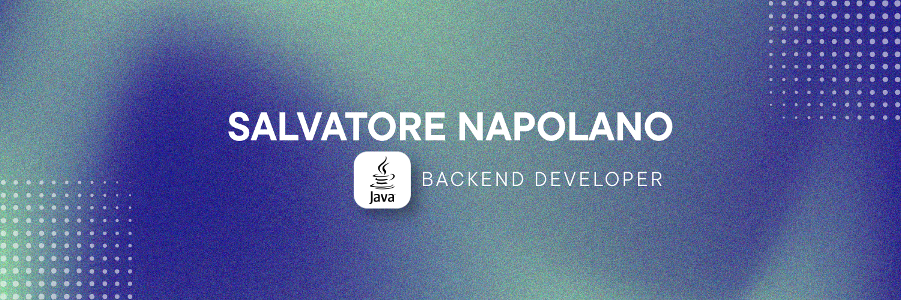

  

<h1 align="center">Ciao, sono Salvatore Napolano 👋</h1>
<h3 align="center">💻 Junior Java Developer con un forte focus sul backend con Java e Spring Boot</h3>

## 🧑🏻‍🎓 Istruzione
🎓 Diploma in Informatica e Telecomunicazioni  
📜 Qualifica EQF5 - Tecnico della programmazione  

---

## 🧠 Cosa faccio

- 🔧 Sviluppo applicazioni backend con **Java & Spring Boot**
- 🌐 Realizzo interfacce web responsive con **HTML, CSS, Bootstrap & Tailwind**
- 🗄️ Progetto e gestisco database con **PostgreSQL & MySQL**
- 🔌 Creo e testo **API REST** con Postman
- 🐳 Utilizzo **Docker** per ambienti di sviluppo e deploy

---

## 🛠️ Tech Stack

### 👨‍💻 Linguaggi

### ⚙️ Backend & Framework

### 🎨 Frontend

### 🗄️ Database

### 🛠️ Tools & DevOps

---

## 📈 Attualmente sto imparando

- Architetture a microservizi con Spring  
- Clean Code e Design Patterns  
- Migliorare il mio inglese tecnico  

---

## 💡 Soft Skills

- Problem solving  
- Teamwork  
- Adattabilità  
- Gestione del tempo  
- Apprendimento continuo  

---

## 📫 Contatti

---

## ⭐ Certificazioni

👉 https://github.com/salvatorenapolano/certifications
